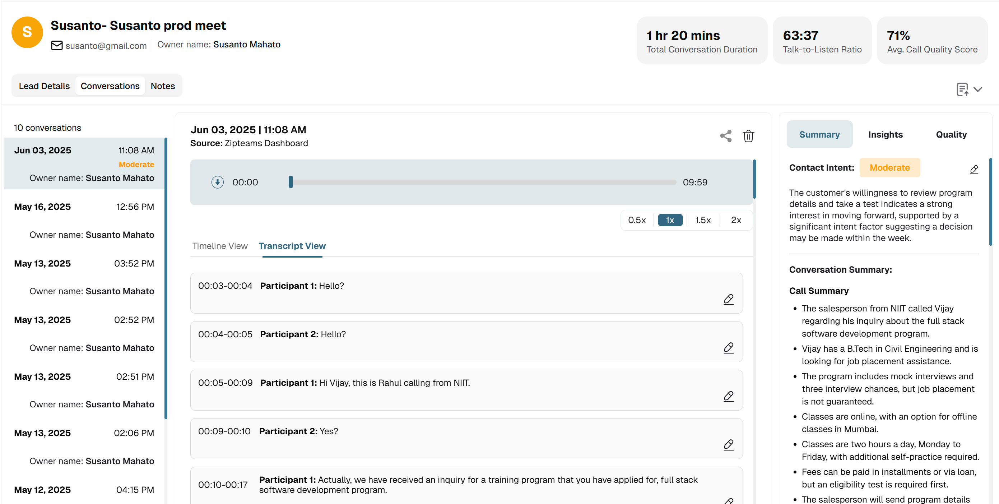
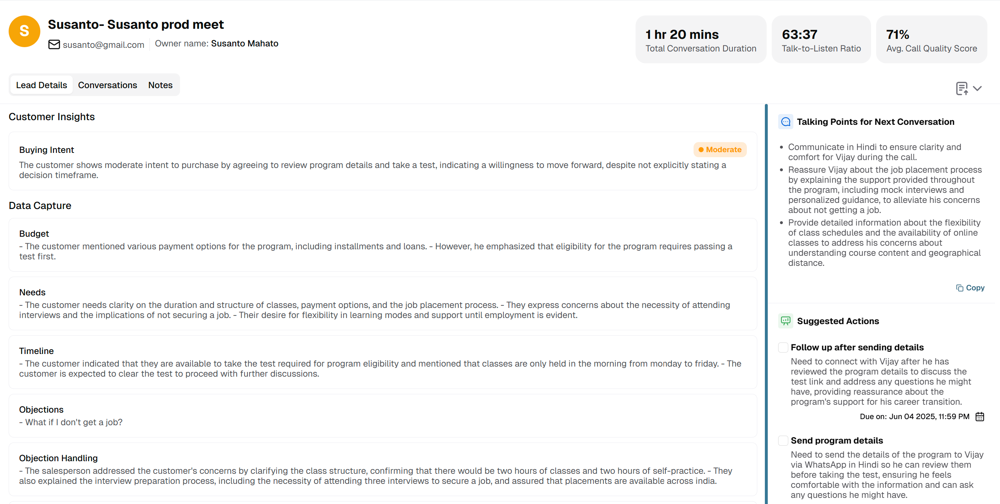

# Customer Details Page

## Overview

Zipteams provides an embeddable Customer Details page that offers a comprehensive view of individual customer interactions and AI-powered analysis. This feature-rich page visualizes critical customer information including:

- Call summaries and transcripts
- AI-generated insights and intent analysis
- BANT (Budget, Authority, Need, Timeline) qualification
- Objection handling recommendations
- Steps to convert the customer
- Detailed call logs and metrics
- Comprehensive AI quality analysis

By embedding this page into your application, you can provide your users with deep, actionable insights for each customer interaction without the complexity and cost of building your own analytics UI.

## Visual Preview

The Customer Details page appears as shown below once you have submitted calls to our platform and our AI has analyzed them:


*Fig 1: Customer Details page showing call summary and key insights*


*Fig 2: Detailed analysis section with BANT qualification and objection handling*

## Key Features and Benefits

- **Comprehensive Call Analysis**: Get detailed breakdowns of each customer interaction
- **AI-Powered Insights**: Leverage advanced AI to identify customer intent, needs, and objections
- **Actionable Recommendations**: Receive specific guidance on how to address objections and move deals forward
- **Seamless Integration**: Easily embed within your existing application with minimal development effort
- **Consistent Branding**: Maintain your application's look and feel while providing powerful analytics

## Getting Started

To embed the Customer Details page in your application, follow these steps:

### Step 1: Ingest Call Recordings

First, submit your call recordings to Zipteams using the [Batch Call Ingestion API](./../partner-api/batch-call-ingestion.md). Make sure to store the `call_id` returned in the response, as you'll need it to access the specific call details.

### Step 2: Obtain Authentication Token

Next, obtain an authentication token using the [Get Auth Token API](./auth-token.md):

### Step 3: Embed the Customer Details Page

After obtaining the authentication token, you can display the Customer Details page in an iframe by constructing a URL with the token and call ID:

```html
<!-- Example iframe implementation -->
<iframe
  src="https://app.zipteams.com/call-details/{call-id}?token={auth-token}"
  width="100%"
  height="800px"
  frameborder="0"
  allow="autoplay; encrypted-media"
  allowfullscreen>
</iframe>
```

Replace `{call-id}` with the ID of the call you want to display and `{auth-token}` with the authentication token you obtained.

## Technical Notes

- This page requires a valid authentication token. If an invalid token is provided, an error will be displayed.
- The page will return an error if an invalid Call ID is passed or if the call hasn't been processed yet.
- The page will start showing data once you have pushed the call to our system using the [Ingestion API](./../partner-api/batch-call-ingestion.md) and our AI has completed analyzing it.
- Each authentication token is unique for a specific tenant and subtenant combination.
- To display the page for multiple subtenants within a tenant, you must generate separate authentication tokens for each subtenant.
- Tokens have a limited validity period of 24 hours. Refer to the [Auth Token API documentation](./auth-token.md#technical-notes) for details.
- This page can only be opened in an iframe on HTTPS webpages and will not open on localhost.
- Once you have completed the integration, you'll need to get your domain whitelisted by Zipteams. Without whitelisting, the page will not render and you'll see a "refused to connect" error.

### Best Practices

- **Token Management**: Implement server-side token generation and refresh mechanisms to ensure tokens are always valid
- **Error Handling**: Add appropriate error handling in your application to gracefully handle cases where the iframe cannot load
- **Responsive Design**: Ensure your container adjusts appropriately to different screen sizes for optimal user experience

## Support

If you encounter any issues or have questions about our APIs, please contact our support team at [support@zipteams.com](mailto:support@zipteams.com).