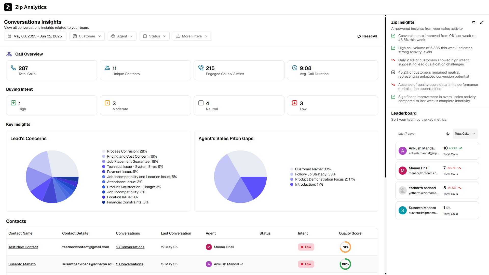

# Overview

Zipteams provides embeddable dashboards that visualize all data pushed to the platform via the [APIs](/partner-api/introduction.md), along with comprehensive AI analysis outputs. These dashboards can be seamlessly embedded into your application interface, allowing you to present sophisticated analytics directly to your customers without the complexity of building custom visualization tools.

The dashboard appears as shown below once you have submitted calls to our platform and our AI has analyzed them:


# Getting Started

To embed the Dashboard in your application interface, you'll need to:

1. [Register as a partner](https://zipme.at/zipteams/15-min-product-demo) to receive your API credentials
2. Obtain an authentication token for accessing the dashboard using the [Get Auth Token API](./auth-token.md)

# Implementation

After obtaining an authentication token, you can display the dashboard for a specific tenant and subtenant (see [Key Terminology](/intro.md#key-terminology) for definitions) by passing the token in the URL:

```
https://app.zipteams.com/view-insights?token={auth-token}
```

# Technical Notes

- Each authentication token is unique for a specific tenant and subtenant combination
- To display dashboards for multiple subtenants within a tenant, you must generate separate authentication tokens for each subtenant
- Tokens have a limited validity period; refer to the [Auth Token API documentation](./auth-token.md#technical-notes) for details
